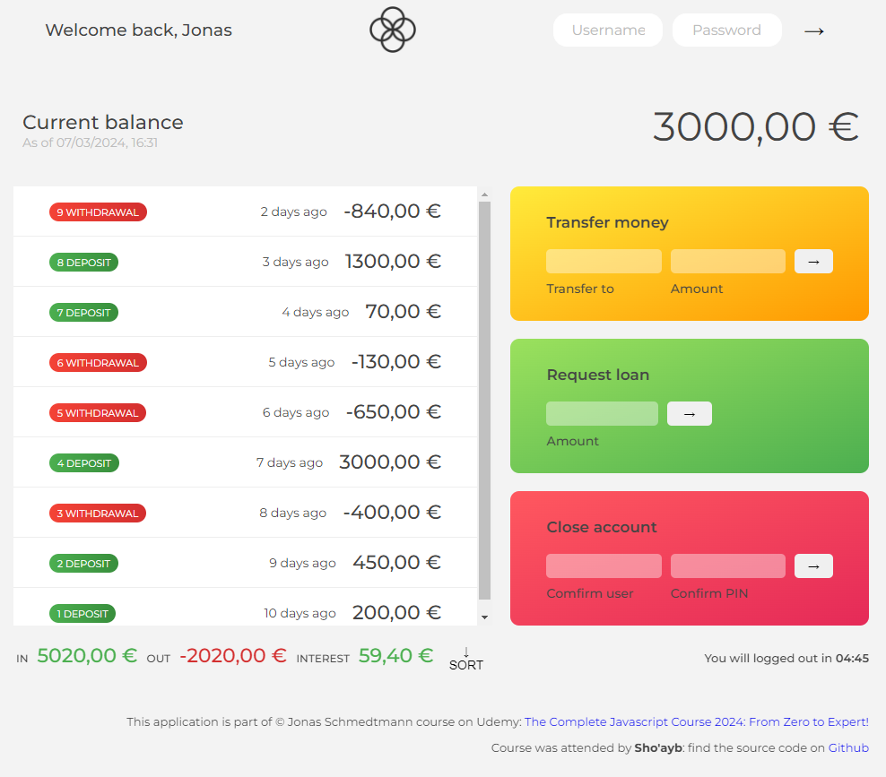

# TABLE OF CONTENTS

[Project Title](#project-title)
[Description](#description)
[Installation](#installation)
[Usage](#usage)
[Guidelines](#guidelines)
[Testing the Application](#testing-the-application)
[Github](#github)
[Contact Us](#contact-us)
[Licence](#licence)

## Project Title

The Bankist App

## Description

Simple Javascript application. The main purpose of which, is to learn how to interact with DOM elements using Javascript and create an application using the functional programming paradigm. 

This application is part of a course by Jonas Schmedtmann: [The Complete Javascript course 2024: From Zero to Hero](https://www.udemy.com/course/the-complete-javascript-course/) on Udemy. 

## Installation

Simple open index.html file in any browser of your choice.

## Usage

The usage of the bankist application is self explanatory: You can login to the application using any of the following usernames and password:

username: js
password: 1111

username: jd
password: 2222

username: stw
password: 3333

username: ss
password: 4444

Once logged, you will note a timer in the bottom right hand corner, you can make a transfer, request a loan or close the account down. There is no logout button, but the application will close after five minutes.

## Guidelines

You can make this application better by including proper movement dates that actually tied to the movements. So when a transaction of debit or credit is made, the movement date and the actual movement will correspond accordingly.

Currently the movement dates are generated on the fly, when the user logs in by a specific function in the application, they are not hard coded in to the accounts movementDates array.

## Testing the Application

You can test this application by making a transfer to any user, by entering their username and the amount, make a loan request for the current logged in user or close the account down.

## Snapshot of the application

## Github

https://github.com/Sho-ayb?tab=repositories

## Deployed live

[The Bankist App](https://sho-ayb.github.io/the-bankist-app/)

## Questions

Sho.ayb@outlook.com

## Licence

MIT License

Please click on the badge for more details on the licence.

